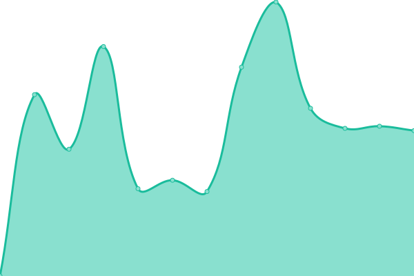
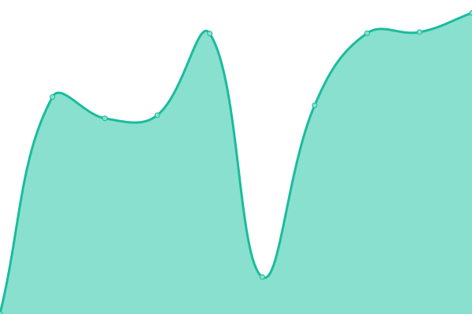

# [📈 Live Status](https://olibrian.github.io/hitobito_upptime): <!--live status--> **🟧 Partial outage**

This repository contains the open-source uptime monitor and status page for [Olivier Brian](https://olibrian.github.io/hitobito_upptime), powered by [Upptime](https://github.com/upptime/upptime).

With [Upptime](https://upptime.js.org), you can get your own unlimited and free uptime monitor and status page, powered entirely by a GitHub repository. We use [Issues](https://github.com/olibrian/hitobito_upptime/issues) as incident reports, [Actions](https://github.com/olibrian/hitobito_upptime/actions) as uptime monitors, and [Pages](https://olibrian.github.io/hitobito_upptime) for the status page.

<!--start: status pages-->
<!-- This summary is generated by Upptime (https://github.com/upptime/upptime) -->
<!-- Do not edit this manually, your changes will be overwritten -->
<!-- prettier-ignore -->
| URL | Status | History | Response Time | Uptime |
| --- | ------ | ------- | ------------- | ------ |
|  [Hitobito Website](https://www.hitobito.ch) | 🟩 Up | [hitobito-website.yml](https://github.com/olibrian/obrian_uptime/commits/HEAD/history/hitobito-website.yml) | 

 1925ms
     
 | 

<a href="https://olibrian.github.io/obrian_uptime/history/hitobito-website">100.00%</a>
    

|  [Hitobito PBS](https://db.scout.ch) | 🟩 Up | [hitobito-pbs.yml](https://github.com/olibrian/obrian_uptime/commits/HEAD/history/hitobito-pbs.yml) | 

 2488ms
     
 | 

<a href="https://olibrian.github.io/obrian_uptime/history/hitobito-pbs">100.00%</a>
    

|  [Hitobito SWW](https://rando-community.ch/) | 🟩 Up | [hitobito-sww.yml](https://github.com/olibrian/obrian_uptime/commits/HEAD/history/hitobito-sww.yml) | 

 1064ms
     
 | 

<a href="https://olibrian.github.io/obrian_uptime/history/hitobito-sww">100.00%</a>
    

|  [My Website](http://obrian.ch/) | 🟩 Up | [my-website.yml](https://github.com/olibrian/obrian_uptime/commits/HEAD/history/my-website.yml) | 

 995ms
     
 | 

<a href="https://olibrian.github.io/obrian_uptime/history/my-website">97.26%</a>
    

|  [QR Ruby](https://qrruby.onrender.com/) | 🟥 Down | [qr-ruby.yml](https://github.com/olibrian/obrian_uptime/commits/HEAD/history/qr-ruby.yml) | 

 397ms
     
 | 

<a href="https://olibrian.github.io/obrian_uptime/history/qr-ruby">100.00%</a>
    

|  [Nextcloud obrian.ch](https://cloud.obrian.ch/) | 🟩 Up | [nextcloud-obrian-ch.yml](https://github.com/olibrian/obrian_uptime/commits/HEAD/history/nextcloud-obrian-ch.yml) | 

 2844ms
     
 | 

<a href="https://olibrian.github.io/obrian_uptime/history/nextcloud-obrian-ch">97.31%</a>
    

|  [Open Source Katalog](https://www.opensource.admin.ch/) | 🟩 Up | [open-source-katalog.yml](https://github.com/olibrian/obrian_uptime/commits/HEAD/history/open-source-katalog.yml) | 

 437ms
     
 | 

<a href="https://olibrian.github.io/obrian_uptime/history/open-source-katalog">100.00%</a>
    

<!--end: status pages-->

[**Visit our status website →**](https://olibrian.github.io/hitobito_uptime)

## How to update github action token:

Generate a new token:
https://github.com/settings/personal-access-tokens

Add the token into Secrets and variables for GitHub Actions
https://github.com/olibrian/obrian_uptime/settings/secrets/actions

## 📄 License

- Powered by: [Upptime](https://github.com/upptime/upptime)
- Code: [MIT](./LICENSE) © [Olivier Brian](https://olibrian.github.io/hitobito_upptime)
- Data in the `./history` directory: [Open Database License](https://opendatacommons.org/licenses/odbl/1-0/)
